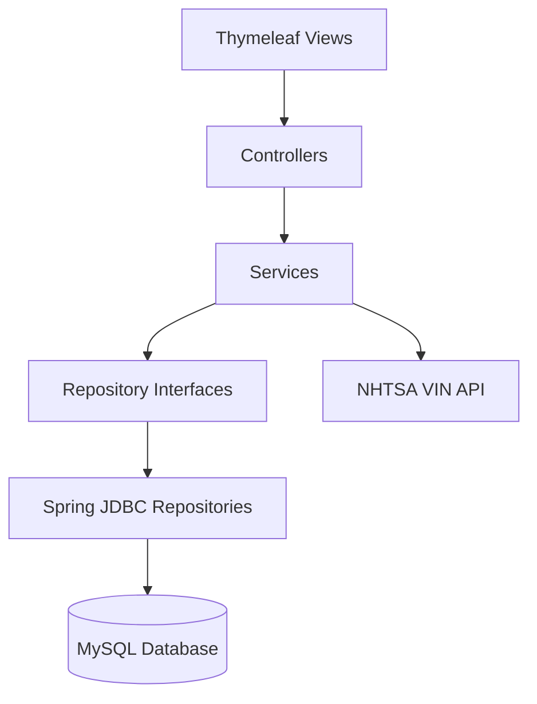

# WheelsUp — Car Subscription Administration System

WheelsUp is a full-stack internal administration system for a fictional car-subscription company. It replaces spreadsheet-based workflows with a structured web application for managing cars, customers, rental agreements, returns, damage reports, users, and business KPIs.

The application was developed as a two-person second-semester AP Computer Science (Datamatiker) project at EK. The project focused on translating business requirements into a maintainable Spring Boot application with a relational database, role-based workflows, automated testing, and CI/CD.

## Core Features

- User login and role-based access for administrators, data-registration staff, damage/repair staff, and business-development users
- Car, customer, user, and rental-agreement administration
- Rental lifecycle management with validation and car-status transitions
- Return registration and damage-report workflows
- Multiple damage items per report with automatic cost aggregation
- Dashboard showing active rentals and business KPIs
- Dynamic filtering and search across cars, users, rental agreements, and damage reports
- VIN decoding through the NHTSA Vehicle API
- Structured application logging and error handling
- Automated Maven builds, tests, and Azure Web App deployment through GitHub Actions

## Architecture

The application follows a layered architecture with a clear separation between HTTP handling, business rules, and persistence.



- **Controllers** handle HTTP requests, session checks, navigation, and form data.
- **Services** contain validation, business rules, transactions, and cross-entity operations.
- **Repositories** use `JdbcTemplate` and parameterized SQL to communicate with the database.
- **Domain models** represent users, customers, cars, rental agreements, damage reports, and damage items.

## Tech Stack

| Area | Technologies |
|---|---|
| Backend | Java 21, Spring Boot 4, Spring MVC |
| Persistence | Spring JDBC, JdbcTemplate, MySQL |
| Frontend | Thymeleaf, HTML, CSS |
| Testing | JUnit, Spring Boot Test, H2 |
| Integration | NHTSA Vehicle Product Information Catalog API |
| Build | Maven, Maven Wrapper |
| CI/CD | GitHub Actions, Azure Web Apps |
| Documentation | PlantUML, Mermaid, Scrum artifacts |

## My Contributions

This was a collaborative two-person project. My primary responsibility covered much of the application's backend foundation and several of its most important end-to-end workflows.

- **Designed and implemented the database foundation**, including the MySQL DDL and seed data for users, customers, cars, rental agreements, damage reports, and damage items. I worked with primary keys, foreign-key constraints, realistic test data, and referential integrity across the domain.

- **Built substantial parts of the layered backend**, including core domain models, repository interfaces and implementations, service-layer methods, and controllers such as `LeaseController`, `DamageController`, and `AuthController`.

- **Implemented the rental-agreement lifecycle**, including creation with an existing or new customer, validation of dates and required entities, prevention of invalid rentals, and coordinated car-status transitions between available, rented, and returned states.

- **Built the damage-report and damage-item workflow**, including validation that a rental and car are eligible for inspection, transactional report creation, status changes to maintenance, multiple damage items per report, and aggregation of total repair cost.

- **Integrated VIN decoding into the car-creation workflow** using the NHTSA API. I implemented response parsing, a two-step decode-and-confirm user flow, automatic population of vehicle details, and graceful handling of incomplete or unavailable API data.

- **Added dynamic filtering and search** across cars, rental agreements, users, and damage reports. This included parameterized dynamic SQL, text matching, status and role filters, and odometer ranges.

- **Improved testing and diagnostics** by refining the H2 test-database configuration and initialization scripts, adding logging across the application layers, and contributing service and integration tests for successful and rejected business flows.

- **Configured delivery automation** with GitHub Actions to build and test feature and master branches and to package and deploy the application to Azure Web Apps while keeping deployment credentials in GitHub Secrets.

## Key Technical Workflows

### Rental Agreement Lifecycle

Creating a rental agreement involves more than inserting a database row. The service validates the selected car, customer, dates, and payment details before creating the agreement and updating the car's status. Returning a car requires another coordinated state transition so it becomes eligible for damage inspection.

### Damage Reporting

A damage report can only be created for a returned car linked to a valid rental agreement. Report creation and the related car-status update are handled transactionally. Damage items are attached to a report individually, while the total cost is calculated from the associated items.

### VIN-Assisted Car Creation

The user enters a VIN, the application requests vehicle data from the NHTSA API, and the response is parsed into a small DTO. The user can review the decoded make, model, and model year before confirming the final car record. The form preserves entered values and displays a useful error if decoding fails or returns incomplete data.

## Lessons Learned

- **Layered architecture became practical rather than theoretical.** Separating controllers, services, and repositories made it clearer where HTTP handling, business rules, and database access belonged. It also made changes easier to isolate and the service layer easier to test.

- **Cross-entity workflows require explicit consistency rules.** Rental creation, car returns, and damage registration all update related entities. Using service-layer validation and transactions showed me why these operations must succeed or fail as a complete unit.

- **Database design should be reviewed throughout development.** The project strengthened my understanding of normalization, foreign keys, and derived data. Looking back, values such as a damage report's total cost are better calculated from damage items than stored redundantly, and some address data could be normalized further.

- **External integrations need resilient user flows.** The VIN API could return incomplete data or fail independently of the application. Building a decode-and-confirm flow taught me to preserve user input, validate external responses, and provide a useful fallback instead of assuming a perfect response.

- **A test database is only useful when it reflects production behavior.** Resolving differences between H2 and MySQL initialization improved my understanding of test isolation, SQL compatibility, seed data, and the value of integration tests alongside mocked service tests.

- **CI/CD turns deployment into a repeatable engineering process.** Automating builds, tests, artifact creation, and Azure deployment reduced manual steps and highlighted the importance of environment variables and secret management.

- **Scope and estimation improve through retrospectives.** The team delivered the MVP early, but later encountered scope growth, overestimated list views, illness, and unplanned holidays. Reviewing velocity and dependencies after each sprint gave me a more realistic understanding of planning and prioritizing core functionality before optional features.

## Testing

The project includes:

- Service-layer unit tests for rental-agreement validation and car-status rules
- Happy-flow integration tests for successful business operations
- Exception-flow integration tests confirming that invalid operations are rejected without persisting inconsistent data
- An in-memory H2 database configured in MySQL compatibility mode

Run the test suite with:

```bash
./mvnw test
```

On Windows:

```powershell
.\mvnw.cmd test
```

## CI/CD

Two GitHub Actions workflows are included:

- **Continuous integration:** builds and tests pushes to `master` and feature branches, as well as pull requests to `master`.
- **Continuous deployment:** packages the Spring Boot application and deploys the JAR artifact to Azure Web Apps after changes reach `master` or the workflow is started manually.

Database configuration is supplied through environment variables, while Azure authentication is handled through GitHub Secrets.

## Running Locally

### Requirements

- Java 21
- MySQL
- Git

Maven does not need to be installed separately because the repository includes the Maven Wrapper.

### 1. Clone the repository

```bash
git clone https://github.com/natfresco-DK/Biludlejning.git
cd Biludlejning
```

### 2. Initialize the database

Run the following scripts in order:

```text
src/main/resources/DDLAndDML/DDL.sql
src/main/resources/DDLAndDML/DML.sql
```

The DML file contains demonstration accounts and sample business data intended for local development only.

### 3. Configure environment variables

```env
DB_URL=jdbc:mysql://localhost:3306/biludlejning
DB_USER=<your-database-user>
DB_PASSWORD=<your-database-password>
```

### 4. Start the application

```bash
./mvnw spring-boot:run
```

On Windows:

```powershell
.\mvnw.cmd spring-boot:run
```

The application will normally be available at `http://localhost:8080`.

## Project Structure

```text
src/main/java/ek/dk/biludlejning/
├── controller/     HTTP endpoints, views, and session access checks
├── model/          Domain models and VIN response DTO
├── repository/     Repository interfaces and JdbcTemplate implementations
├── service/        Business rules, validation, transactions, and integrations
└── utility/        Supporting utilities

src/main/resources/
├── DDLAndDML/      MySQL schema and development seed data
├── templates/      Thymeleaf views
├── static/         CSS and images
└── application.properties

src/test/
├── java/           Unit and integration tests
└── resources/      H2 configuration and test schema/data
```

## Future Improvements

- Replace custom authentication with Spring Security and a password-specific hashing algorithm such as BCrypt or Argon2
- Centralize authorization checks instead of repeating access logic in individual controllers
- Remove sensitive values from logs and introduce structured audit logging
- Replace string-based roles and statuses with enums or dedicated value types
- Use Testcontainers to run integration tests against MySQL-compatible infrastructure
- Calculate derived damage totals instead of persisting redundant values
- Add stronger request validation and consistent global exception handling
- Add pagination for larger data sets and expand the reporting dashboard
- Containerize the application with Docker
- Complete the planned inventory overview and configurable alarm functionality

## Team

- **Simon Nat Rignel Fresco** — Product Owner and Developer
- **Oliver Egholm Folkersen** — Scrum Master and Developer

The project was created for educational purposes as part of the second-semester Datamatiker programme at EK.
